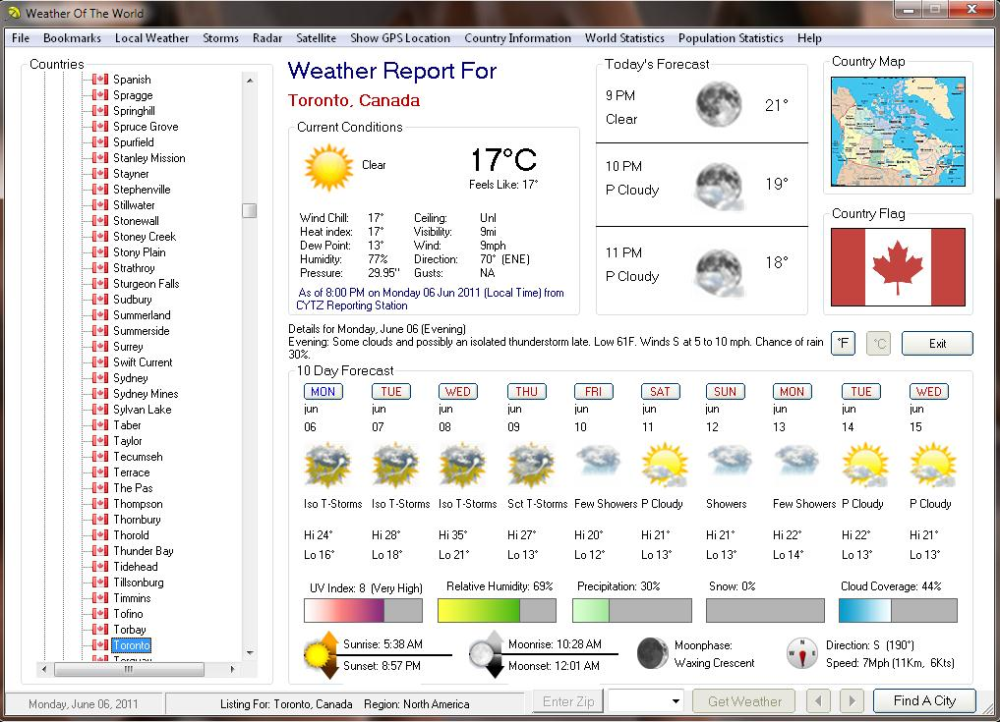



## Weather Of The World

### Description

This is the ultimate weather program, Weather Of the World will give the weather of all cities in ever countries, their G.P.S. location, facts & statics about that country, time & date and many more. please vote and or give any suggestion you may have. also many thanks to all the programmers on P.S.C. that I have used snippets of their code to create Weather Of The World.
 
### More Info
 

             |
---                |---
**Submitted On**   |2011-06-13 23:33:10
**By**             |[Kenneth Dillon](https://github.com/Planet-Source-Code/PSCIndex/blob/master/ByAuthor/kenneth-dillon.md)
**Level**          |Intermediate
**User Rating**    |5.0 (35 globes from 7 users)
**Compatibility**  |VB 5\.0, VB 6\.0
**Category**       |[Complete Applications](https://github.com/Planet-Source-Code/PSCIndex/blob/master/ByCategory/complete-applications__1-27.md)
**World**          |[Visual Basic](https://github.com/Planet-Source-Code/PSCIndex/blob/master/ByWorld/visual-basic.md)
**Archive File**   |[Weather\_Of2206286132011\.zip](https://github.com/Planet-Source-Code/kenneth-dillon-weather-of-the-world__1-73951/archive/master.zip)

